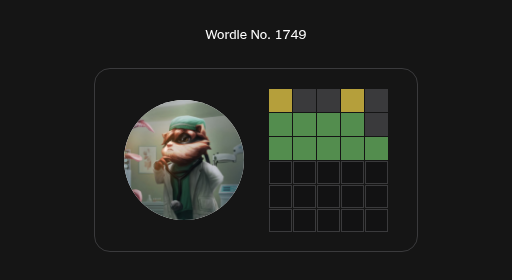

### ➕ [Add the bot to your Discord server](https://discord.com/oauth2/authorize?client_id=1425892168471548006&scope=bot+applications.commands&permissions=2251799813762048)

Then run `/setup channel` in the server — that's the whole setup.

---

# Daily Scoreboard Bot

Reads a Discord channel for daily puzzle results — Wordle, Connections, Pips and a
dozen more — and posts a scoreboard for yesterday's games, with streaks, per-game
stats, and a live "Now Playing" sticky at the bottom of the channel.

One deployment serves any number of servers. Configuration is **per server**, stored
in DynamoDB and managed entirely from Discord with `/setup`; environment variables
carry only the bot's global identity. Adding the bot to a server and running `/setup`
there is the whole onboarding — no redeploy, no config file.

## What members see

| Surface | What it is |
|---|---|
| **Daily scoreboard** | Posted and pinned to the output channel once a day at the server's chosen hour: every scored game someone played yesterday, ranked scores, a points summary, and the server's streaks — off-rotation plays listed below the scored games for zero points. |
| **Today's games** | Posted at the server's day start while rotation is on (the default): the rotating subset of games that scores today, as play links. Lands right under the board when the board posts at that same hour. Servers that would rather not have a second daily message can switch just this post off. |
| **Now Playing sticky** | One message kept at the bottom of the input channel: how much the server has played today, today's games as play buttons, the server streak in its heading, and **Play**, **Scores** and **Yesterday** underneath. |
| **`/play`** | A private list of games as buttons, linking straight to each puzzle, ordered by what the server is actually playing. It lists everything *except* the games already on the sticky, so the two don't repeat; **`/play all:true`** puts the whole roster in one list. |
| **`/stats`** | A private view of your own streaks — overall, then game by game. Every streak on the board belongs to the server; this is where yours are. |
| **`/suggest`** | Anyone can propose a game the bot doesn't track yet. |
| **`/setup`** | Where admins configure the server (needs **Manage Server**). |

Players do nothing special — they paste their result into the input channel as usual
and the bot picks it up.

## Games supported

| Game | Link | Tracked by default |
|---|---|---|
| Bandle | https://bandle.app/daily | yes |
| Chronophoto | https://www.chronophoto.app/daily.html | yes |
| Color | https://dialed.gg/color?d=1 | yes |
| Color-Toon | https://dialed.gg/color2?d=1 | yes |
| Connections | https://www.nytimes.com/games/connections | yes |
| Enclose | https://enclose.horse | yes |
| Flagle | https://flagle.org | no |
| Gerrymandle | https://gerrymandle.com | yes |
| Globle | https://globle.org | no |
| Krillion | https://krillion.io | yes |
| MapTap | https://maptap.gg | yes |
| MapTap Challenge | https://maptap.gg/adventures?gametype=challenge | no |
| Minute Cryptic | https://www.minutecryptic.com | yes |
| Pips | https://www.nytimes.com/games/pips | yes |
| Quizl | https://quizl.io | yes |
| Sound | https://dialed.gg/sound?d=1 | yes |
| Sports Connections | https://www.nytimes.com/athletic/connections-sports-edition | yes |
| Travle | https://travle.earth | yes |
| Wordle | https://www.nytimes.com/games/wordle | yes |
| Worldle | https://worldlegame.io | no |

Every game can be flipped either way per server with `/setup games` — the column above
is only what a server gets before anyone touches that menu.

Wordle counts pasted share text everywhere. Results the official Wordle Discord bot posts
as *images* are ignored until a server opts in — see
[Wordle image results](#wordle-image-results).

---

# Adding the bot to your Discord server

## 1. Invite it

Open the [invite link](https://discord.com/oauth2/authorize?client_id=1425892168471548006&scope=bot+applications.commands&permissions=2251799813762048),
choose your server (you need **Manage Server** there) and authorize. It asks for five
permissions and nothing else:

| Permission | What it's for |
|---|---|
| View Channel | Seeing the input and output channels |
| Read Message History | Parsing results posted while it wasn't looking |
| Send Messages | Posting the scoreboard and the sticky |
| Manage Messages | Stripping link previews off the sticky, collapsing duplicate stickies |
| Pin Messages | Pinning the daily board, and unpinning it once it ages out |

Pin Messages is its own permission, not part of Manage Messages: Discord split it out
with the current pins API, so a server invited on the older four-permission integer
(`76800`) posts its board fine and then fails the pin with `403 / 50013`.

Running your own instance? Build the link from your own application on the **OAuth2**
tab of the [Developer Portal](https://discord.com/developers/applications) — scopes
`bot` and `applications.commands`, the five permissions above, which is the integer
`2251799813762048`:

```
https://discord.com/oauth2/authorize?client_id=<APPLICATION_ID>&scope=bot+applications.commands&permissions=2251799813762048
```

The bot has to be running somewhere before its slash commands do anything — see
[Self-hosting on AWS](#self-hosting-on-aws) below.

## 2. Point it at a channel

Run this in the server:

- **`/setup channel`** — the one channel the bot reads scores from and posts in.

That is the whole thing for most servers. If you want the daily scoreboard to land
somewhere other than where people paste their results, override one side afterwards:

- **`/setup input`** — read scores from a different channel (the sticky follows it).
- **`/setup output`** — post the daily scoreboard to a different channel.

Each moves only the side it names and leaves the other where `/setup channel` put it.

All three take a channel from the native picker, or `channel_id:<id>` for channels the
picker can't show, or no arguments at all — the reply is then a channel-select menu.
Every path verifies the bot can actually see the channel and tells you what to fix if
it can't; a private channel needs the bot's role added to it.

Nothing posts until a channel is set. **`/setup show`** prints the whole configuration.

## 3. Tune it (optional)

Defaults in parentheses.

- **`/setup time timezone:<IANA name> day_start_hour:<0-23> post_hour:<0-23> window_hours:<1-24>`**
  (`UTC` / `0` / day start hour / `24`) — `day_start_hour` is when a scoring day rolls
  over, `post_hour` is the local hour the board posts, `window_hours` is how long
  submissions stay open each day. Example: `America/New_York`, day start 3, post 9,
  window 21 keeps submissions open 3AM–midnight local and posts the board at 9AM.
- **`/setup limits minimum_players:<n> message_volume:<hundreds per day>`**
  (`1` / `1`) — `minimum_players` hides (and stops scoring) games with fewer players
  than that, `message_volume` is roughly how many hundreds of messages a day the input
  channel sees.
- **`/setup games`** — a multi-select of every supported game, pre-ticked to this
  server's current state.
- **`/setup rotation enabled:<bool> games:<1-20> mode:<swap|random> keep_players:<n> promote_players:<n> off_rotation:<shown|hidden> announce:<bool>`**
  (`true` / `3` / `swap` / `5` / `5` / `shown` / `true`) — score only a rotating subset of games
  each day. In `swap` mode a spot is earned by play, against two separate thresholds:
  a game in the set holds its seat by drawing `keep_players`, a game outside it earns
  one by drawing `promote_players`, and random picks fill the rest. Splitting the two
  is how a server sets seats that are easy to win and hard to hold, or the reverse.
  `games` is a hard cap — when more games qualify than fit, the most-played keep the
  seats. `random` re-draws the whole set daily and consults neither threshold.
  `off_rotation` only decides whether the daily board lists off-rotation plays below
  the scored games for zero points, or leaves them off the board — either way they're
  archived, keep streaks alive, and still count toward rotating in. The
  day's set is what the sticky puts up as buttons, so `/play` and the sticky's Play button
  list everything else — `/play all:true` puts both halves in one list. It is drawn and announced at the server's **day start**, so a server that
  posts its board later still gets today's games first thing; when the two hours match
  (the default) the announcement lands right under the board. `announce:false` silences
  that post without touching the rotation itself — the day's set is still drawn, still
  scores the board, and still shapes the sticky and `/play`; the server just gets one
  message a day instead of two.
- **`/setup daily enabled:false`** — pause the daily post. The sticky drops its
  Yesterday link while paused, since whatever board is still in the channel is stale.
  Today's games keep being drawn and announced — pausing the board doesn't pause the
  rotation.
- **`/setup sticky enabled:false`** — remove the sticky. While it's on, `games:1-5` puts
  that many of today's games on it as play buttons (off by default) — one row's worth is
  the cap, and whatever lands there is what `/play` leaves out.
- **`/setup embeds suppress:false`** — stop stripping link previews off posted results
  (`true` by default). Stripping happens as the sticky counts each result, so it needs
  **Manage Messages** and does nothing at all while the sticky is off. Turning it off
  doesn't restore previews already stripped.

## Suggesting a game

`/suggest` is open to everyone: a form taking a game name, an optional link, and a
pasted result from a game the bot doesn't track yet. The bot forwards it — paste kept
verbatim, mentions defused, link un-embedded — to the operator's dev channel, where it
becomes a candidate for a new game.

Suggestions naming a game that is already supported are answered on the spot instead of
forwarded, including the case worth acting on: *supported, but turned off in this
server — an admin can switch it back on with `/setup games`*. If the operator hasn't
configured a dev channel, the command still answers, saying it has nowhere to send them.

## Wordle image results



**Always on, nothing to configure.** The official
[Wordle Discord bot](https://support.nytimes.com/s/article/wordle-discord-bot) posts
results as images rather than text, and this bot reads them — matching each grid to a
player by their avatar. That bot is one application with the same ID in every server it
joins, so there's nothing to look up and no setting to turn on.

It costs nothing in a server that doesn't have it. Both image paths key on the message's
author being that exact bot, and both are reached only after a message has failed to
match every game's text pattern — so no image is downloaded and no avatar is looked up
until a real grid shows up.

---

# Self-hosting on AWS

Everything below is the one-time job of standing up an instance. It's independent of
the Discord steps above — once it's running, each new server just needs the invite link
and `/setup`.

## What gets built

| Function | Module | Trigger | Role |
|---|---|---|---|
| `daily-game-score` | `src/lambda_function.py` | EventBridge rule `time`, `cron(0 * * * ? *)` | Posts + pins yesterday's scoreboard, folds streaks |
| `daily-game-sticky` | `src/sticky_lambda.py` | EventBridge rule `daily-game-sticky`, `cron(* * * * ? *)` | Keeps the "Now Playing" sticky at the channel bottom |
| `daily-game-play` | `src/interaction_lambda.py` | Public Function URL | Slash commands and buttons |

Plus one DynamoDB table (`daily-game-tracker`, provisioned 5/5), an IAM role and policy
per function, 30-day log retention, and the interaction lambda's Function URL. All in
`us-east-1`, all inside the AWS always-free tier. Full design: [`docs/SPEC.md`](docs/SPEC.md).

The daily rule is **hourly**, not daily — the handler decides who is due on each tick, so
each server draws today's games when its own day start comes around and posts its board
when its own `post_hour` does.

## 0. Prerequisites

- Python 3 and `pip install -r requirements.txt` (run everything from the repo root).
- AWS credentials in the usual boto3 chain, with access to Lambda, DynamoDB,
  EventBridge, CloudWatch Logs and IAM. Steps your identity can't perform are printed
  as commands to re-run with an admin identity rather than failing the run.

## 1. Create the Discord application

In the [Developer Portal](https://discord.com/developers/applications):

- **Bot** page — reset and copy the token. Turn on **Public Bot** if anyone other than
  you should be able to add the bot to a server. Enable **Server Members Intent** if you
  want [Wordle image results](#wordle-image-results): it is used to read server-specific
  avatars when matching grids to players, and is only ever exercised in servers that have
  opted in — without it those matches fall back to global avatars.
- **General Information** page — copy the Application ID and Public Key.

Then write a `.env` in the repo root:

```bash
DISCORD_BOT_TOKEN=...        # Bot page
DISCORD_BOT_ID=...           # Application ID
DISCORD_APPLICATION_ID=...   # same value; register_commands falls back to DISCORD_BOT_ID
DISCORD_PUBLIC_KEY=...       # General Information page; verifies interaction signatures
TEST_CHANNEL_ID=...          # where local/test-mode runs post
TEST_GUILD_ID=...            # server the interaction fixtures pretend to come from
TEST_USER_ID=...             # whose stats the /stats fixture asks for
DEV_CHANNEL_ID=...           # optional: where /suggest submissions land
MINIMUM_STREAK=3             # optional: shortest streak that renders, and sorts (default 3)
```

That is the complete list — these are global identity only. **Per-server settings live
only in the table; there is no environment fallback for them.**

## 2. Build the stack with `infra_setup`

```bash
dotenv run -- python3 tools/infra_setup.py --plan   # diff only, changes nothing
dotenv run -- python3 tools/infra_setup.py          # converge to the declared state
dotenv run -- python3 tools/infra_setup.py --prune  # also remove what isn't declared
```

`tools/infra_setup.py` reads live state first and writes only the difference, so a run
against an empty account builds the whole stack and a run against a healthy one prints
all-ok and touches nothing. `--plan` exits non-zero when it finds drift, which makes it
usable as a check.

It is deliberately conservative in two places: env values that **differ** from your
local environment are reported, never overwritten (a rotated secret must not be
reverted by a stale `.env`), and **undeclared** env vars and layers are only removed
under `--prune`. It never writes table items — data is not infrastructure.

The run ends with a `config` section listing every configured server, and a checklist
of what it cannot do itself. That checklist is steps 3 and 4.

## 3. Ship the code

Functions are created with placeholder code that raises, so deploy before expecting
anything to work. The workflows in `.github/workflows/` own that:

| Workflow | Function |
|---|---|
| `deploy.yml` | `daily-game-score` |
| `deploy-sticky.yml` | `daily-game-sticky` |
| `deploy-interaction.yml` | `daily-game-play` |

They need `AWS_ACCESS_KEY_ID` and `AWS_SECRET_ACCESS_KEY` in the repository's
`production` environment. Each runs on pushes touching its own modules and can be run
by hand (`workflow_dispatch`) — which is how a freshly created function gets filled.

Dependencies are bundled, never inherited: every workflow installs `requests`, `Pillow`
and `python-dateutil` into the zip (plus `PyNaCl` for the interaction lambda) in a
Lambda-matched SAM container, and asserts they are present at the archive root before
uploading, so a missing dependency fails the build instead of the next cold start.

## 4. Wire up Discord

1. Paste the Function URL `infra_setup` reports into **Interactions Endpoint URL** on
   the application's General Information page. Discord verifies it with a signed PING,
   so the interaction lambda must already have real code deployed.
2. Register the slash commands:
   ```bash
   dotenv run -- python3 tools/register_commands.py
   ```
   Bulk overwrite, safe to re-run — do it whenever a command or option changes.
3. Invite the bot and run `/setup` — see
   [Adding the bot to your Discord server](#adding-the-bot-to-your-discord-server).

## 5. Verify

```bash
dotenv run -- python3 src/lambda_function.py       # test-mode scoreboard
dotenv run -- python3 src/interaction_lambda.py    # replay an interaction fixture
dotenv run -- python3 tools/infra_setup.py --plan  # should report no drift
```

A local run of `lambda_function.py` is always test mode: it posts to `TEST_CHANNEL_ID`,
never pins, and never advances the "already posted today" marker. `interaction_lambda.py`
replays `tests/events/interaction/interaction_sticky_scores.json` by default; pass
another fixture path as an argument. In the server, `/setup show` should print the
configuration you just wrote.

Every click and command the bot serves prints one JSON line to the interaction lambda's
log group (`/aws/lambda/daily-game-play`), so CloudWatch Logs Insights can show who uses
what — `filter event = "interaction" | stats count() by name, username`. That is the
bot's only usage record; the scheduled lambdas keep none.

## Seeding streak history (optional)

Streaks otherwise start from the first day the store sees. Replay channel history so
they launch at their true values:

```bash
dotenv run -- python3 tools/backfill.py --all           # or --days N
dotenv run -- python3 tools/backfill.py --rebuild-only  # recompute aggregates, no Discord
```

Re-running is safe. `--rebuild-only` recomputes every aggregate from the archived days
and is also what you run after a scoring-rule change.

---

# Repository layout

```
src/      the six modules that ship to Lambda
tools/    local-only CLIs (never deployed)
tests/    event fixtures for local runs
docs/     SPEC.md, the design doc
img/      README assets
```

`src/` is packaged **flat** into each deploy zip (`zip -j`), because the handlers are
configured as `<module>.lambda_handler` and so the modules must sit at the archive root.
`tools/` scripts put `src/` on `sys.path` at startup, so they run against exactly the
code that deploys.

Run every command from the repository root.
